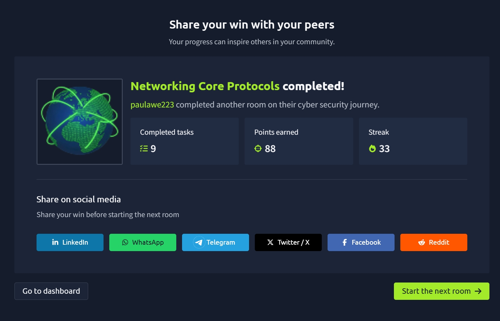

# Networking Core Protocols

The **Networking Core Protocols** room introduced me to the application-layer protocols that make everyday Internet communication possible. I learned how domain names are resolved using DNS, how websites are accessed through HTTP and HTTPS, how files are transferred with FTP, and how email is sent and received using SMTP, POP3, and IMAP. The room also demonstrated how these protocols work behind the scenes using tools like **Telnet**, **nslookup**, and **Wireshark**, helping me understand what actually happens when I browse the web, download files, or send emails. :contentReference[oaicite:0]{index=0}

---

## 🧠 What I Learned

### 🌍 Domain Name System (DNS)

DNS acts like the Internet's phone book by translating human-readable domain names into IP addresses that computers can understand.

I learned that:

- DNS operates at the **Application Layer (Layer 7)**.
- It uses **UDP port 53** by default and falls back to **TCP port 53** when necessary.
- Without DNS, we would need to memorize IP addresses for every website we visit.

The most common DNS records include:

- **A Record** – Maps a hostname to an IPv4 address.
- **AAAA Record** – Maps a hostname to an IPv6 address.
- **CNAME Record** – Maps one domain name to another.
- **MX Record** – Identifies the mail server responsible for a domain's email.

I also learned how to use:

```bash
nslookup example.com
```

to retrieve DNS information directly from the command line. :contentReference[oaicite:1]{index=1}

---

## 🔍 WHOIS

WHOIS provides information about who owns or registered a domain name.

A WHOIS lookup can reveal:

- Domain registrar
- Creation date
- Expiration date
- Registration status
- Registrant details (unless privacy protection is enabled)

The Linux command:

```bash
whois example.com
```

retrieves this information.

I also learned that many domain owners use privacy protection services to hide their personal information from public WHOIS records. :contentReference[oaicite:2]{index=2}

---

## 🌐 HTTP and HTTPS

HTTP (Hypertext Transfer Protocol) is the protocol used to load web pages.

HTTPS is simply the secure version of HTTP.

Both protocols use TCP:

- **HTTP → Port 80**
- **HTTPS → Port 443**

Some common HTTP methods include:

- **GET** – Retrieve data from a server.
- **POST** – Submit new data.
- **PUT** – Create or update resources.
- **DELETE** – Remove resources.

One of the most interesting parts of the room was seeing HTTP requests and responses in Wireshark. I also learned that HTTP requests can be sent manually using Telnet for troubleshooting purposes. :contentReference[oaicite:3]{index=3}

---

## 📁 File Transfer Protocol (FTP)

FTP is specifically designed for transferring files between computers.

Unlike HTTP, which focuses on web content, FTP is optimized for uploads and downloads.

Default port:

- **TCP Port 21**

Common FTP commands include:

- `USER`
- `PASS`
- `RETR`
- `STOR`

I also practiced connecting to an FTP server, listing available files, and downloading files using the FTP client.

```bash
ftp MACHINE_IP
```

Watching the FTP communication in Wireshark helped me understand how client commands differ from server responses and how separate connections are used for directory listings and file transfers. :contentReference[oaicite:4]{index=4}

---

## 📧 Simple Mail Transfer Protocol (SMTP)

SMTP is responsible for sending email.

It works similarly to taking a letter to the post office—the sender provides the recipient's information, and the mail server forwards the message.

SMTP uses:

- **TCP Port 25**

Some common SMTP commands are:

- `HELO` / `EHLO`
- `MAIL FROM`
- `RCPT TO`
- `DATA`
- `QUIT`

The room demonstrated how to send an email manually using Telnet, which made it much easier to understand how email clients communicate with mail servers behind the scenes. :contentReference[oaicite:5]{index=5}

---

## 📬 POP3

POP3 (Post Office Protocol version 3) is used to retrieve email from a mail server.

It operates on:

- **TCP Port 110**

Common POP3 commands include:

- `USER`
- `PASS`
- `STAT`
- `LIST`
- `RETR`
- `DELE`
- `QUIT`

I learned that POP3 is best suited for a single device because messages are typically downloaded from the server, and users should avoid sending usernames and passwords over unencrypted connections since they can be intercepted. :contentReference[oaicite:6]{index=6}

---

## 📨 IMAP

IMAP (Internet Message Access Protocol) also retrieves email but is designed to synchronize messages across multiple devices.

Unlike POP3:

- Emails remain stored on the server.
- Read, deleted, and moved messages stay synchronized.
- Multiple devices always display the same mailbox.

IMAP uses:

- **TCP Port 143**

Some useful IMAP commands include:

- `LOGIN`
- `SELECT`
- `FETCH`
- `MOVE`
- `COPY`
- `LOGOUT`

This makes IMAP the preferred choice for users who access email from phones, tablets, and computers. :contentReference[oaicite:7]{index=7}

---

## 🔢 Default Port Numbers

One of the most useful parts of this room was learning the default ports for common networking protocols.

| Protocol | Port |
|----------|-----:|
| Telnet | 23 |
| DNS | 53 |
| HTTP | 80 |
| HTTPS | 443 |
| FTP | 21 |
| SMTP | 25 |
| POP3 | 110 |
| IMAP | 143 |

Memorizing these ports will be very helpful for networking, troubleshooting, and cybersecurity. :contentReference[oaicite:8]{index=8}

---

## 🎯 Key Takeaways

- Learned how DNS resolves domain names into IP addresses.
- Understood common DNS records including A, AAAA, CNAME, and MX.
- Learned how WHOIS reveals domain registration information.
- Understood how HTTP and HTTPS enable web browsing.
- Learned how FTP transfers files between systems.
- Understood how SMTP sends email.
- Learned how POP3 retrieves email for a single device.
- Understood how IMAP synchronizes email across multiple devices.
- Practiced using command-line tools such as `nslookup`, `whois`, `ftp`, and `telnet`.
- Memorized the default port numbers for the most common networking protocols.

---

## 📸 Proof of Completion


