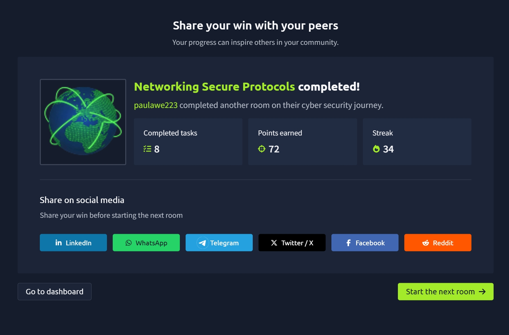

# Networking Secure Protocols

The **Networking Secure Protocols** room completed the four-room networking series in TryHackMe Cyber Security 101. After learning how core protocols such as HTTP, SMTP, POP3, IMAP, FTP, and Telnet work, this room focused on how network communication can be protected against eavesdropping, modification, and impersonation.

I learned how **TLS** adds security to existing plaintext protocols, how **SSH** provides secure remote access, the differences between **SFTP and FTPS**, and how **VPNs** create secure communication tunnels across untrusted networks. :contentReference[oaicite:0]{index=0}

---

## 🧠 What I Learned

### 🔐 Why Secure Protocols Matter

Traditional networking protocols were originally designed to exchange information without necessarily protecting the data being transmitted.

This creates three major security concerns:

- **Confidentiality** – Preventing unauthorized people from reading data.
- **Integrity** – Ensuring data cannot be modified during transmission.
- **Authenticity** – Confirming that we are communicating with the legitimate server.

Without these protections, an attacker monitoring network traffic could potentially intercept credentials, emails, financial information, or other sensitive data.

Secure protocols solve these problems using technologies such as **encryption, certificates, authentication, and tunneling**. :contentReference[oaicite:1]{index=1}

---

## 🔒 SSL and TLS

**SSL (Secure Sockets Layer)** was developed to secure communication across the web.

It was later replaced by:

**TLS – Transport Layer Security**

TLS provides secure communication between clients and servers across untrusted networks.

Its primary security benefits include:

- Confidentiality
- Integrity
- Authentication

Modern Internet services rely heavily on TLS to protect sensitive information such as passwords, financial transactions, emails, and private communications.

The current major version introduced in the room is:

```text
TLS 1.3
```

:contentReference[oaicite:2]{index=2}

---

## 📜 TLS Certificates

For a server to prove its identity, it can obtain a signed **TLS certificate**.

The general process involves:

1. The server administrator creates a **Certificate Signing Request (CSR)**.
2. The CSR is submitted to a **Certificate Authority (CA)**.
3. The CA verifies the request.
4. The CA issues a signed digital certificate.
5. Clients can verify the certificate using trusted CA certificates installed on their systems.

This allows users to verify that they are communicating with the legitimate server rather than an impersonator.

I also learned about **self-signed certificates**. Although they can provide encryption, they cannot independently prove a server's authenticity because no trusted third party has verified the certificate. :contentReference[oaicite:3]{index=3}

---

# 🌐 HTTP vs HTTPS

HTTP normally communicates using:

```text
TCP Port 80
```

HTTP traffic is transmitted in plaintext, meaning someone capturing network traffic may be able to inspect the exchanged information.

A normal HTTP connection involves:

```text
DNS Resolution
      ↓
TCP Three-Way Handshake
      ↓
HTTP Communication
```

:contentReference[oaicite:4]{index=4}

---

## 🔐 HTTPS

HTTPS stands for:

**Hypertext Transfer Protocol Secure**

Essentially:

```text
HTTPS = HTTP + TLS
```

HTTPS normally operates on:

```text
TCP Port 443
```

The connection process becomes:

```text
DNS Resolution
      ↓
TCP Three-Way Handshake
      ↓
TLS Session
      ↓
Encrypted HTTP Communication
```

Instead of HTTP requests being visible to someone capturing packets, the application data is encrypted.

This was especially interesting to see through Wireshark because without the appropriate encryption keys, the contents of the captured HTTPS communication cannot simply be read like normal HTTP traffic. :contentReference[oaicite:5]{index=5}

---

# 📧 Securing Email Protocols

TLS isn't limited to HTTP.

It can also secure email protocols that would otherwise communicate without encryption.

The room covered:

```text
SMTP  → SMTPS
POP3  → POP3S
IMAP  → IMAPS
```

The **S** indicates that the protocol is secured using TLS. :contentReference[oaicite:6]{index=6}

---

## 🔢 Insecure vs Secure Ports

I learned the default ports used by both the plaintext and TLS-secured versions of these protocols.

| Protocol | Default Port |
|---|---:|
| HTTP | 80 |
| HTTPS | 443 |
| SMTP | 25 |
| SMTPS | 465 / 587 |
| POP3 | 110 |
| POP3S | 995 |
| IMAP | 143 |
| IMAPS | 993 |

Understanding these ports is particularly useful when analyzing network traffic, configuring firewalls, troubleshooting services, or investigating suspicious connections. :contentReference[oaicite:7]{index=7}

---

# 💻 SSH – Secure Shell

Earlier in the networking series, I learned about **Telnet**, which allows remote access to another system.

The major problem with Telnet is that its communication is sent in plaintext.

This means credentials and commands could potentially be captured by someone monitoring the network.

**SSH (Secure Shell)** solves this problem by providing encrypted remote access.

SSH normally operates on:

```text
TCP Port 22
```

while Telnet uses:

```text
TCP Port 23
```

:contentReference[oaicite:8]{index=8}

---

## 🛡️ SSH Security Features

SSH provides several important capabilities.

### Secure Authentication

SSH supports:

- Password authentication
- Public-key authentication
- Two-factor authentication

### Confidentiality

SSH encrypts communication between the client and server, protecting the connection from eavesdropping.

### Integrity

Cryptographic protections help prevent transmitted information from being modified.

### Tunneling

SSH can create encrypted tunnels that allow other protocols to communicate securely.

### X11 Forwarding

SSH can even forward graphical applications from a remote Unix-like system across the network.

:contentReference[oaicite:9]{index=9}

---

## 💻 Connecting with SSH

A basic SSH connection can be established using:

```bash
ssh username@hostname
```

For example:

```bash
ssh user@192.168.1.10
```

If the remote username is the same as the current local username, the username can be omitted:

```bash
ssh hostname
```

This provides a secure way to remotely administer systems without exposing credentials and commands through plaintext network traffic. :contentReference[oaicite:10]{index=10}

---

# 📂 SFTP vs FTPS

I also learned that **SFTP and FTPS are not the same thing**, even though both provide secure file transfers.

## SFTP

SFTP stands for:

**SSH File Transfer Protocol**

It is part of the SSH protocol suite and uses:

```text
TCP Port 22
```

A connection can be established using:

```bash
sftp username@hostname
```

Files can then be downloaded using:

```bash
get filename
```

or uploaded using:

```bash
put filename
```

---

## FTPS

FTPS stands for:

**File Transfer Protocol Secure**

Unlike SFTP, FTPS is essentially **FTP secured using TLS**.

The room identifies its usual port as:

```text
TCP Port 990
```

A simple way for me to remember the difference is:

```text
SFTP → SSH
FTPS → FTP + TLS
```

:contentReference[oaicite:11]{index=11}

---

# 🌍 Virtual Private Networks (VPN)

A **VPN (Virtual Private Network)** allows secure communication across an otherwise untrusted network such as the Internet.

For example, a company might have:

```text
Main Office
    ↕
 Internet
    ↕
Remote Office
```

Instead of exposing private company traffic directly across the Internet, a VPN can establish an encrypted tunnel between the locations.

:contentReference[oaicite:12]{index=12}

---

## 🔐 VPN Tunneling

The VPN client encrypts traffic before sending it through the Internet.

Conceptually:

```text
Device
   ↓
VPN Client
   ↓
Encrypted VPN Tunnel
   ↓
Internet
   ↓
VPN Server
   ↓
Private Network
```

This allows remote offices or individual employees to securely access resources on a private network without physically being connected to it.

---

## 🌐 VPNs and Public IP Addresses

When Internet traffic is routed through a VPN, websites will generally see the **VPN server's public IP address** rather than the user's original public IP address.

For example:

```text
User
 ↓
VPN Server in Japan
 ↓
Website
```

The website may see the connection as originating from Japan.

I also learned that not every VPN routes all traffic through the tunnel, and VPN configurations can potentially leak information such as the user's real IP address. Depending on the purpose of the VPN, additional checks such as a **DNS leak test** may therefore be useful. :contentReference[oaicite:13]{index=13}

---

# 🔢 Important Ports to Remember

| Protocol | Port | Purpose |
|---|---:|---|
| SSH | 22 | Secure remote access |
| Telnet | 23 | Insecure remote access |
| HTTP | 80 | Web traffic |
| HTTPS | 443 | Secure web traffic |
| SMTP | 25 | Sending email |
| SMTPS | 465 / 587 | Secure email sending |
| POP3 | 110 | Retrieving email |
| POP3S | 995 | Secure POP3 |
| IMAP | 143 | Email synchronization |
| IMAPS | 993 | Secure IMAP |
| SFTP | 22 | File transfer over SSH |
| FTPS | 990 | FTP secured with TLS |

---

# 🎯 Key Takeaways

- Understood why confidentiality, integrity, and authenticity are essential for network security.
- Learned how TLS protects communication across insecure networks.
- Understood the role of Certificate Authorities and TLS certificates.
- Learned how HTTPS protects HTTP communication using TLS.
- Understood how SMTP, POP3, and IMAP can be secured using TLS.
- Learned why SSH replaced Telnet for secure remote administration.
- Practiced the basic syntax for connecting to systems using SSH.
- Learned the difference between SFTP and FTPS.
- Understood how VPNs create encrypted tunnels across untrusted networks.
- Learned how VPNs can connect remote offices and individual users to private networks.
- Reinforced my knowledge of important secure and insecure protocol ports.

---

## 🏁 Networking Series Completed

With this room completed, I have now worked through all four networking rooms in this section of **TryHackMe Cyber Security 101**:

```text
✅ Networking Concepts
✅ Networking Essentials
✅ Networking Core Protocols
✅ Networking Secure Protocols
```

These rooms helped me progress from understanding how network communication works to understanding how that communication can be secured.

---

## 📸 Proof of Completion


